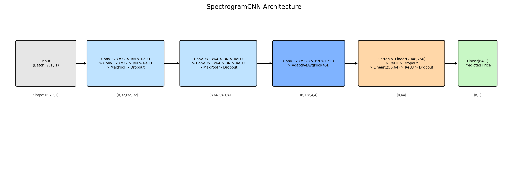
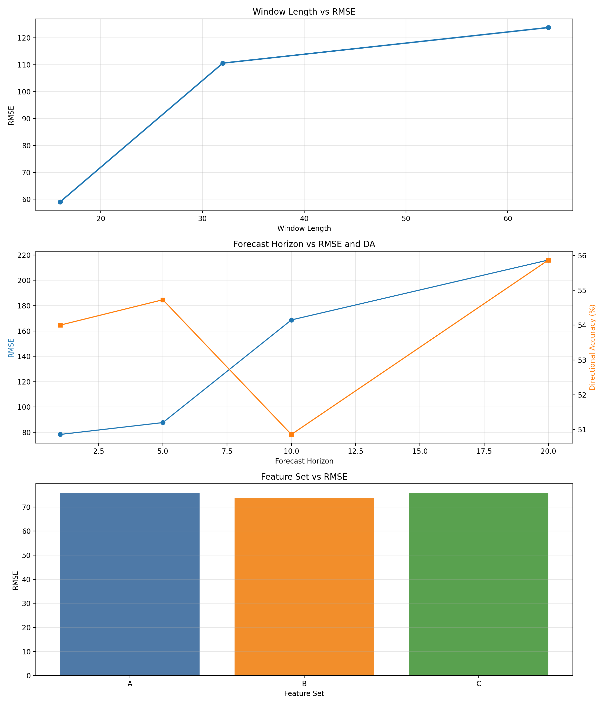
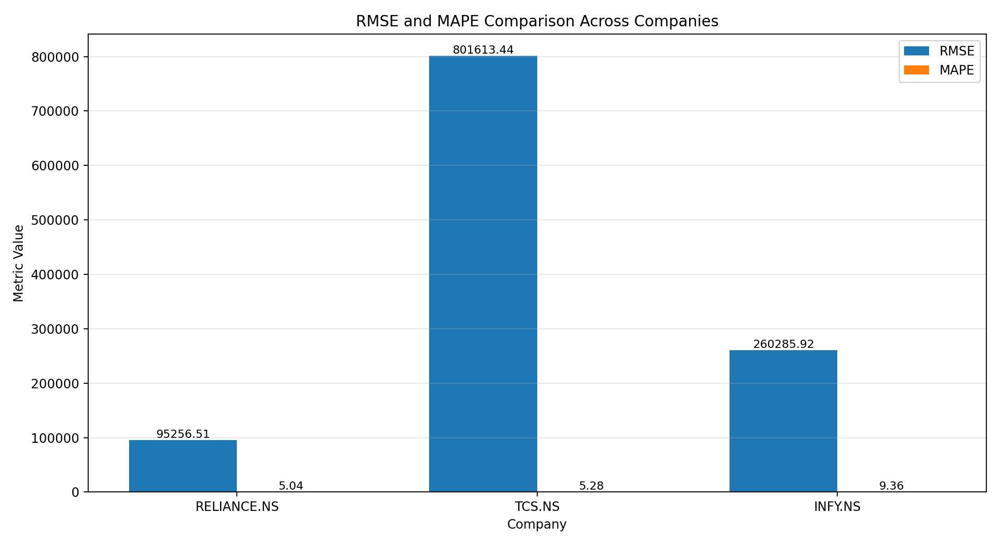
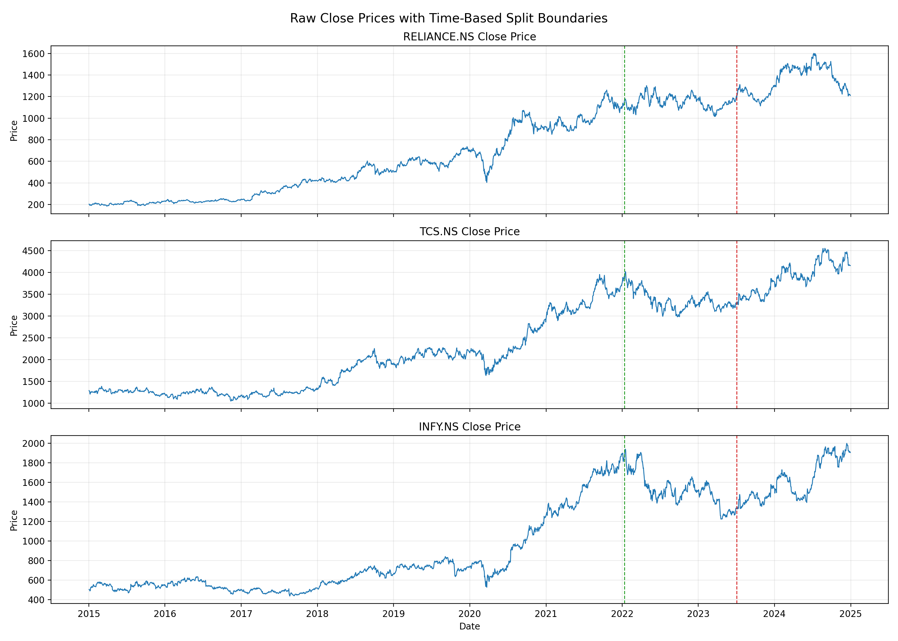

# Stock Price Forecasting - STFT Spectrogram + CNN

<p align="center">
    
    
    
    
</p>

<p align="center">
    Time-frequency deep learning pipeline for stock forecasting using multi-channel spectrograms.
</p>

## Highlights
- End-to-end ML workflow: collection -> features -> spectrograms -> training -> evaluation -> ablation
- Time-frequency representation of financial signals using STFT
- CNN regressor with reproducible experiments and saved artifacts
- Comparative evaluation and ablation analysis with published figures

## Author

<p>
    <strong><span style="font-size: 3.1em;">Surya T S</span></strong><br/>
    <strong><span style="font-size: 3.1em;">University ID: TCR24CS069</span></strong>
</p>

## Overview
This repository presents an end-to-end stock forecasting system that converts financial time series into STFT spectrograms and predicts future close price using a CNN regressor.

The pipeline uses:
- Companies: RELIANCE.NS, TCS.NS, INFY.NS
- Context channels: Sensex (^BSESN), USD/INR (INR=X)
- Time range: 2015-01-01 to 2024-12-31

Core idea:
- Build a multivariate signal from market + technical indicators
- Convert each rolling window into a multi-channel spectrogram tensor
- Train CNN for regression on future raw close prices

## Tech Stack
- Python, NumPy, pandas, SciPy
- PyTorch for deep learning
- scikit-learn for preprocessing and metrics
- matplotlib for visualization
- yfinance for market data ingestion

## Quick Visuals

| CNN Architecture | Ablation Summary |
|---|---|
|  |  |

| Metrics Comparison | Time-Series Snapshot |
|---|---|
|  |  |

## Additional Visuals
Only the most important visuals are shown above.

Please explore all generated plots in the figures folder:
- [figures](./figures)

## Data Snapshot
- Raw downloads: `data/raw/`
- Engineered features and splits: `data/processed/`
- Spectrogram tensors: `data/spectrograms/`
- Trained checkpoints: `models/`
- Evaluation and experiment visuals: `figures/`

For complete implementation details, see the scripts in `src/`.

## Methodology

### Signal Representation
Each stock is represented as a 7-channel financial signal $X(t)$:
1. close
2. log_return
3. volatility
4. RSI
5. MACD
6. sensex_close
7. usd_inr

These channels are date-aligned and processed with sliding windows.

### STFT Spectrogram Generation
For every channel and window:

$$
S(t,f) = |\mathrm{STFT}(t,f)|^2
$$

Configured defaults:
- Window length $L=32$
- Hop size $H=8$
- Overlap $=24$
- Window function: Hann

Log compression is applied:

$$
S_{\log}(t,f)=\log(1+S(t,f))
$$

All channel spectrograms are stacked to $(C,F,T)$ where $C=7$ for the full feature setting.

### CNN Architecture
The model has three convolutional blocks followed by a regression head:
- Block 1: Conv(7->32), BN, ReLU, Conv(32->32), BN, ReLU, MaxPool, Dropout2d
- Block 2: Conv(32->64), BN, ReLU, Conv(64->64), BN, ReLU, MaxPool, Dropout2d
- Block 3: Conv(64->128), BN, ReLU, AdaptiveAvgPool(4,4)
- Head: Flatten -> Linear(2048,256) -> ReLU -> Dropout -> Linear(256,64) -> ReLU -> Dropout -> Linear(64,1)

Total trainable parameters: 682,273

## How to Run
1. Clone and open the project
```bash
git clone https://github.com/Surya-T-S/SpectraForecast.git
cd SpectraForecast/stock-forecasting
```

2. Install dependencies
```bash
pip install -r requirements.txt
```

3. Run the pipeline in order
```bash
python src/01_data_collection.py
python src/02_feature_engineering.py
python src/03_spectrogram_generator.py
python src/06_train.py
python src/07_evaluate.py
python src/08_ablation.py
```

4. Check outputs
- Metrics: `data/processed/metrics.csv`
- Ablation: `data/processed/ablation_results.csv`
- Figures: `figures/`
- Best models: `models/`

## Reproducibility
- Config-driven experiment settings are managed in `config.yaml`
- Random seeds are fixed in training and ablation scripts
- Key outputs are saved to `data/processed/`, `figures/`, and `models/`

## Results

### Test Metrics (metrics.csv)
| Company | MSE | RMSE | MAE | MAPE | R2 | DirectionalAccuracy |
|---|---:|---:|---:|---:|---:|---:|
| RELIANCE.NS | 9073802020.781618 | 95256.506449 | 73030.074042 | 5.044303 | 0.460769 | 54.729730 |
| TCS.NS | 642584105744.464200 | 801613.439099 | 632152.206517 | 5.279589 | 0.176190 | 51.689189 |
| INFY.NS | 67748759467.157616 | 260285.918688 | 217532.847837 | 9.363170 | 0.165913 | 51.351351 |

### Ablation Results (ablation_results.csv)
| Experiment | Parameter | Value | RMSE | MAPE | DA |
|---|---|---|---:|---:|---:|
| WindowLength | window_length | 16 | 59.003105 | 3.420948 | 50.675676 |
| WindowLength | window_length | 32 | 110.616553 | 6.177357 | 56.081081 |
| WindowLength | window_length | 64 | 123.848049 | 7.086399 | 54.391892 |
| ForecastHorizon | forecast_horizon | 1 | 78.323368 | 4.711698 | 54.000000 |
| ForecastHorizon | forecast_horizon | 5 | 87.691336 | 5.274692 | 54.729730 |
| ForecastHorizon | forecast_horizon | 10 | 168.727545 | 9.897689 | 50.859107 |
| ForecastHorizon | forecast_horizon | 20 | 216.029003 | 12.948932 | 55.871886 |
| FeatureSet | feature_set | A | 75.858105 | 4.296529 | 51.013514 |
| FeatureSet | feature_set | B | 73.747189 | 4.268317 | 53.378378 |
| FeatureSet | feature_set | C | 75.824293 | 4.436028 | 54.729730 |

## Key Findings
- Best RMSE in window ablation occurred at $L=16$.
- Best directional accuracy in horizon ablation occurred at $\Delta t=20$.
- Feature Set B (close + technical indicators) improved over close-only baseline A.
- RELIANCE.NS was easiest to model overall (lowest RMSE, best $R^2$).
- TCS.NS showed the largest absolute errors, while INFY.NS had the highest relative error (MAPE).

## References
1. Y. Zhang and C. Aggarwal, Stock Market Prediction Using Deep Learning, IEEE Access.
2. A. Tsantekidis et al., Deep Learning for Financial Time Series Forecasting.
3. S. Hochreiter and J. Schmidhuber, Long Short-Term Memory, Neural Computation, 1997.
4. A. Borovykh et al., Conditional Time Series Forecasting with CNNs.

## License
This project is licensed under the MIT License. See `LICENSE` for details.
